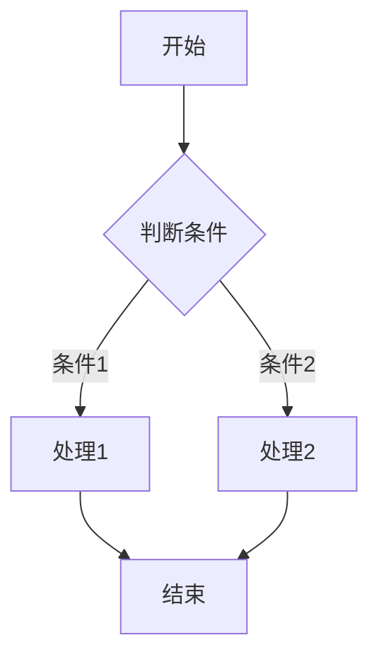

## 环境配置 [jekyll](https://jekyllrb.com/)


### 安装 [Homebrew](https://brew.sh/zh-cn/) 

安装 HomeBrew

```
/bin/bash -c "$(curl -fsSL https://raw.githubusercontent.com/Homebrew/install/HEAD/install.sh)"
```

提示成功后 ⚠️ 注意 iterm2 ｜ 终端 提示文案 执行下面两行
```
echo 'eval "$(/opt/homebrew/bin/brew shellenv)"') >> /Users/youMacName/.zprofile
eval "$(/opt/homebrew/bin/brew shellenv)"
```

### Ruby安装与升级方法

安装Ruby有多种方式，主要有rvm和rbenv两种工具。下面分别介绍两种方式：

#### 使用RVM安装Ruby

安装 rvm
```
 \curl -sSL https://get.rvm.io | bash -s stable
```
执行 `rvm -v` 查看是否按转过成功

使用 `rvm list` ｜ `rvm list known` 查看本地 或者远端有哪些 `ruby` 版本
```ruby
 * ruby-3.0.0 [ arm64 ]

# => - current
# =* - current && default
#  * - default
```

```ruby
# MRI Rubies
[ruby-]1.8.6[-p420]
[ruby-]1.8.7[-head] # security released on head
[ruby-]1.9.1[-p431]
[ruby-]1.9.2[-p330]
[ruby-]1.9.3[-p551]
[ruby-]2.0.0[-p648]
[ruby-]2.1[.10]
[ruby-]2.2[.10]
[ruby-]2.3[.8]
[ruby-]2.4[.10]
[ruby-]2.5[.8]
[ruby-]2.6[.6]
[ruby-]2.7[.2]
[ruby-]3[.0.0]
ruby-head
```
以 `ruby-3.0.0` 为例：`rvm install 3.0.0`。如果本地存在多分 可以使用 `rvm use 3.0.0` 来使用 `3.0` 版本

#### 使用rbenv安装Ruby（推荐）

rbenv是一个轻量级Ruby版本管理工具，相比RVM更加简洁，对系统侵入性更小。

1. 安装rbenv:
```bash
brew install rbenv ruby-build
```

2. 配置shell环境:
```bash
对于zsh
echo 'eval "$(rbenv init -)"' >> ~/.zshrc
source ~/.zshrc
对于bash
echo 'eval "$(rbenv init -)"' >> ~/.bash_profile
source ~/.bash_profile
```

3. 安装Ruby（以3.2.3为例）:
```bash
rbenv install 3.2.3
```

4. 设置全局Ruby版本:
```bash
rbenv global 3.2.3
```

5. 验证安装:
```bash
ruby -v
# 应显示: ruby 3.2.3p157 (2023-03-30 revision 956adca9)
```

### Jekyll主题安装与依赖问题处理

当使用Jekyll主题（如jekyll-theme-chirpy）时，可能会遇到依赖问题，尤其是Ruby版本不匹配的情况。

#### 常见依赖问题与解决方案

1. Ruby版本冲突：
```
Bundler found conflicting requirements for the Ruby version:
  In Gemfile:
    Ruby
    jekyll-theme-chirpy (~> 6.5) was resolved to 6.5.5, which depends on
      Ruby (>= 3.0)
```
解决方案：按照上面的方法升级Ruby到3.0以上版本。

2. 找不到主题gem:
```
Could not find gem 'jekyll-theme-chirpy (~> 6.5, >= 6.5.5)' in any of the gem sources listed in your Gemfile.
```

解决方案：

```bash
# 更新RubyGems
gem update --system

# 安装bundler
gem install bundler

# 清理并更新bundler
bundle clean --force
bundle update
```

3. 安装依赖包:
```bash
bundle install
```

4. 启动本地服务器:
```bash
bundle exec jekyll serve
```

### Mermaid图表支持配置

Mermaid是一种基于JavaScript的图表和可视化库，可用于创建流程图、时序图、甘特图等。在Jekyll中使用Mermaid需要一些额外配置。

#### 在Jekyll中启用Mermaid

1. 在文章的Front Matter中启用Mermaid:
```yaml
---
layout: post
title: "文章标题"
date: 2024-03-29
mermaid: true
---
```

2. 对于Chirpy主题，确保`_config.yml`中包含以下配置:
```yaml
mermaid:
  enabled: true
  version: "9.4.3"  # 或更新版本
```

3. 在文章中使用Mermaid语法:
```
flowchart TD
    A[开始] --> B{判断条件}
    B -->|条件1| C[处理1]
    B -->|条件2| D[处理2]
    C --> E[结束]
    D --> E
```



4. 如果主题默认不支持Mermaid，可在`_includes/head.html`或相应位置添加:

```html

<script src="https://cdn.jsdelivr.net/npm/mermaid/dist/mermaid.min.js"></script>
<script>
  document.addEventListener("DOMContentLoaded", function() {
    mermaid.initialize({
      startOnLoad: true,
      theme: '{{ site.mermaid.theme | default: "default" }}',
    });
  });
</script>

```

通过以上配置，您的Jekyll博客将能够渲染Mermaid图表，为技术文档提供更丰富的可视化展示。

### jekyll & jekyll-theme-chirpy


## 配置 GitHub Pages 站点的自定义域
验证 [参考文档：](https://docs.github.com/zh/pages/configuring-a-custom-domain-for-your-github-pages-site/verifying-your-custom-domain-for-github-pages)
Page [参考文档：](https://docs.github.com/zh/pages/configuring-a-custom-domain-for-your-github-pages-site/about-custom-domains-and-github-pages)

1. 配置 Github Page Domain
2. 验证自定义 Domain
3. 添加可用 DNS 节点

### 添加 Page 自定义 Domain
{:width="70%"}

### 验证 自定义 Domain

- 在任何页面的右上角，单击个人资料照片，然后单击"设置"。

  - {:width="50%"}
- 在边栏的"代码、规划和自动化"部分中，单击"Pages"。
  
-  在"要添加什么域？"下，输入要验证的域，然后选择"添加域"
   - {:width="70%"}
-  按照"添加 DNS TXT 记录"下的说明，使用域托管服务创建 TXT 记录。
   - {:width="70%"}
- 到自己域名下的 DNS 解析服务中添加 TXT
  -  {:width="70%"}
- 提示验证成功即可
  - {:width="70%"}

### 设置正确可解析的 DNS

Ipv4 相关 DNS

```bash
185.199.108.153
185.199.109.153
185.199.110.153
185.199.111.153
```

Ipv6 相关 DNS

```bash
2606:50c0:8000::153
2606:50c0:8001::153
2606:50c0:8002::153
2606:50c0:8003::153
```

{:width="70%"}
